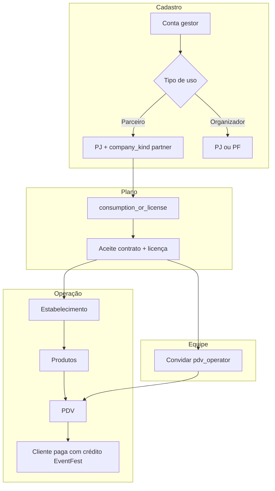

# Empresa parceira — guia operacional

**Atualizado:** 2026-06-02  
**Escopo:** cadastro, plano, PDV, operadores e criação pelo Admin Master.

---

## 1. O que é “empresa parceira” no sistema

| Conceito | Implementação |
|----------|----------------|
| Empresa parceira | `companies.company_kind = 'partner'` |
| Plano comercial | `consumption_or_license` (Consumo / licença / mensal) |
| Ponto de venda | `credit_establishments` |
| Produtos do PDV | `credit_establishment_products` |
| Cobrança no balcão | `/manager/credit/pdv` |
| Operador de balcão | `user_companies.role = 'pdv_operator'` |

A parceira **não vende ingressos** pela plataforma. Opera consumo com **crédito EventFest** na rede.

---

## 2. Modelos de negócio

### A — Parceiro independente (CNPJ próprio)

Bar, food truck ou loja com CNPJ próprio na rede EventFest.

### B — Consumo no evento de um produtor

| Situação | Quem cadastra | Plano |
|----------|---------------|-------|
| Bar interno do festival (mesmo CNPJ do produtor) | Produtor | `ticket_plus_consumption` |
| Bar de outro CNPJ no festival | Empresa parceira separada | `consumption_or_license` |

No cadastro do estabelecimento, o parceiro pode vincular opcionalmente um `event_id` para aparecer na carteira do cliente naquele evento.

---

## 3. Cadastro pelo próprio parceiro (autoatendimento)

### Passo a passo

1. Acesse **`/manager/register/account`** e crie a conta (confirme o e-mail).
2. Em **`/manager/register`**, aceite o contrato de adesão.
3. Escolha **“Empresa parceira (consumo)”** no assistente de perfil.
4. Cadastre como **Pessoa Jurídica** em **`/manager/register/company`**.
5. Vá em **Configurações → Perfil da Empresa → Plano e cobrança**.
6. Selecione **Consumo / licença / mensal** (card marcado como *Recomendado*).
7. Aceite o contrato do plano e **pague a licença mensal**.
8. Cadastre o estabelecimento em **Estabelecimentos** (menu ou Configurações).
9. Cadastre **produtos** no catálogo do estabelecimento.
10. Use **PDV Crédito** para cobrar o QR da carteira do cliente.

### Menu liberado (plano consumo)

- Dashboard, Eventos (vitrine), Banners
- **Estabelecimentos** e **PDV Crédito**
- Relatórios (exceto vendas de ingressos / financeiro de ingressos)
- Configurações

**Oculto:** Ingressos, Chaves de validação, relatórios de vendas de ingressos.

---

## 4. Cadastro pelo Admin Master

### Passo a passo

1. Admin → **Planos das Empresas** → **Nova empresa parceira**  
   (`/admin/settings/partner-companies/create`)
2. Informe CNPJ, razão social, e-mail corporativo e **e-mail do gestor**.
3. O sistema cria a empresa com:
   - `company_kind = partner`
   - `billing_plan = consumption_or_license`
   - cobrança de licença do mês (se aplicável)
4. Se o e-mail do gestor **já tiver conta**, o vínculo como `owner` é imediato.
5. Se **não tiver conta**, fica **convite pendente** — o gestor deve:
   - criar conta em `/manager/register/account` com o **mesmo e-mail**, ou
   - fazer login com esse e-mail  
   → o sistema aceita o convite automaticamente.

6. Oriente o gestor a concluir: **Plano e cobrança** → aceite + pagamento da licença.

### Pré-requisitos (Admin)

- Módulo de consumo ativo em **Admin → Preços e comissões**
- Contrato `consumption_or_license` publicado em **Admin → Contratos**

---

## 5. Operadores PDV (funcionários do balcão)

### O que o operador pode fazer

- Acessar **PDV Crédito**
- Gerenciar **catálogo de produtos** nos estabelecimentos existentes
- Ver **Perfil individual** (logout)

### O que o operador **não** pode fazer

- Criar/editar estabelecimentos
- Alterar plano, contrato ou dados da empresa
- Acessar relatórios gerais, eventos, ingressos

### Convidar operador (proprietário)

1. **Configurações → Operadores PDV** (`/manager/settings/pdv-operators`)
2. Informe o e-mail do funcionário → **Convidar**
3. Se já existir conta → acesso imediato como `pdv_operator`
4. Se não existir → convite pendente; funcionário cria conta com o mesmo e-mail

---

## 6. Checklist antes de operar o PDV

| # | Requisito | Onde verificar |
|---|-----------|----------------|
| 1 | Plano `consumption_or_license` ou `ticket_plus_consumption` | Perfil da Empresa → Plano |
| 2 | Contrato do plano aceito | Perfil da Empresa → Plano |
| 3 | Licença do mês paga (plano consumo) | Relatório Licença mensal (consumo) |
| 4 | Módulo consumo ativo na plataforma | Admin → Preços e comissões |
| 5 | Estabelecimento ativo + aceita crédito | Estabelecimentos (crédito) |
| 6 | Produtos cadastrados (opcional, agiliza PDV) | Catálogo no estabelecimento |

---

## 7. Arquivos técnicos de referência

| Tema | Caminho |
|------|---------|
| Migration parceiro + PDV | `supabase/migrations/20260727120000_partner_companies.sql` |
| Tipos e sessão de cadastro | `src/constants/company-kind.ts` |
| Papéis | `src/constants/company-roles.ts` |
| Assistente de cadastro | `src/components/ManagerUseCaseSelectionDialog.tsx` |
| Admin criar parceira | `src/pages/AdminCreatePartnerCompany.tsx` |
| Operadores PDV | `src/pages/ManagerPdvOperators.tsx` |
| Guard operador | `src/components/PdvOperatorRouteGuard.tsx` |
| RPCs convite / admin | `src/utils/company-members.ts` |

---

## 8. Fluxo resumido (diagrama)

---

## 9. Suporte / problemas comuns

| Sintoma | Causa provável | Ação |
|---------|----------------|------|
| Menu sem PDV | Plano sem consumo ou licença pendente | Confirmar plano e pagar licença |
| “Sem permissão” ao salvar estabelecimento | Usuário é `pdv_operator` | Apenas o **owner** cria estabelecimentos |
| Convite não vincula | E-mail diferente do convite | Usar exatamente o e-mail convidado |
| Parceiro vê menu de ingressos | Plano errado ou migration não aplicada | Aplicar migration e conferir `billing_plan_features` |

---

*Documento de apoio ao modelo comercial de empresas parceiras EventFest.*
