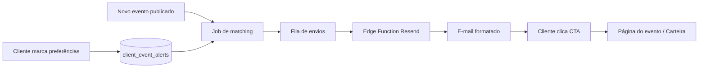

# Plano de ação — Alertas de eventos por e-mail (“Eventos para você”)

Documento de referência para análise e desenvolvimento futuro.

**Status:** planejamento (não implementado)  
**Stack atual:** Supabase (Postgres + Edge Functions), Resend (e-mail), React, perfil com cidade/estado, eventos com categoria/localização, carteira de créditos EventFest.

---

## Objetivo do produto

Permitir que o cliente **opt-in** receba e-mails periódicos (ou imediatos) com **eventos relevantes** (cidade, região, categorias de interesse), em layout rico (imagem, preço, local, data) e **copy com gatilhos mentais** sobre **créditos EventFest** para aumentar conversão e participação.

---

## Nome sugerido na área do cliente

Evitar apenas “Newsletter” (soa genérico). Opções:

| Nome na UI | Descrição |
|---|---|
| **Eventos para você** (recomendado) | Alertas personalizados de eventos |
| **Alertas de eventos** | Foco em novidades na região |
| **Preferências de e-mail** | Mais neutro, dentro de Minha conta |

---

## Visão geral da arquitetura

**Infraestrutura existente a reaproveitar:**

- Edge Function `send-free-registration-email` — padrão Resend + HTML
- `profiles.cidade`, `profiles.estado`, CEP/endereço
- `events.category`, `location`, `address`, `address_lat`, `address_lng`
- `events.exposure_card_image_url`, `banner_image_url`
- Carteira de créditos (`/wallet`) e eventos com `credit_consumption_enabled`

---

## Fase 0 — Definição e LGPD (1–2 dias)

### Decisões de negócio

- Opt-in explícito (checkbox **desmarcado** por padrão).
- Texto de consentimento: finalidade, frequência, como cancelar.
- Link **“Cancelar alertas”** em todo e-mail (one-click unsubscribe).
- Registrar `consented_at`, `consent_version`; IP opcional.
- Não enviar para quem não completou e-mail verificado no auth.

### Frequências sugeridas

| Fase | Tipo | Descrição |
|---|---|---|
| MVP | **Resumo semanal** | Recomendado para começar — menos spam |
| Fase 2 | **Alerta imediato** | Quando evento novo bate com interesse |
| Opcional | **Resumo mensal** | Baixa prioridade |

### Perguntas em aberto (fechar antes de codar)

1. Envio só para **clientes** (`tipo_usuario_id = 3`) ou também gestores?
2. “Região” = **mesma cidade**, **mesmo estado** ou **raio em km** (ex.: 50 km)?
3. Eventos **gratuitos**, **pagos** e **só vitrine** (`listing_only`) entram no e-mail?

---

## Fase 1 — Modelo de dados (2–3 dias)

### Tabela principal: `client_event_alert_preferences`

| Campo | Tipo | Uso |
|---|---|---|
| `user_id` | uuid PK/FK `profiles` | Dono |
| `is_enabled` | boolean | Master switch |
| `frequency` | enum | `weekly`, `instant` (fase 2) |
| `use_profile_location` | boolean | Usar cidade/estado do perfil |
| `preferred_cities` | text[] | Ex.: `['São Paulo', 'Campinas']` |
| `preferred_states` | text[] | Ex.: `['SP', 'RJ']` |
| `preferred_categories` | text[] | Ex.: `['Música', 'Gastronomia']` |
| `include_free_events` | boolean | default true |
| `include_paid_events` | boolean | default true |
| `include_credit_events` | boolean | Destacar eventos que aceitam crédito |
| `last_digest_sent_at` | timestamptz | Controle anti-duplicidade |
| `unsubscribe_token` | uuid unique | Link de descadastro |
| `consented_at` | timestamptz | LGPD |

### Tabela de log: `client_event_alert_sends`

| Campo | Uso |
|---|---|
| `user_id`, `event_id`, `sent_at`, `resend_id`, `campaign_type` | Auditoria, métricas, evitar reenvio |

### Melhoria em `events` (recomendada)

Normalizar **`event_city`** e **`event_state`** no cadastro (além de `location`/`address`) para matching preciso. Hoje o filtro por cidade na landing usa `location` — para e-mail, convém campo estruturado.

### RPCs sugeridas

- `get_my_event_alert_preferences`
- `upsert_my_event_alert_preferences`
- `unsubscribe_event_alerts(token)`
- `match_events_for_user_alert(p_user_id, p_since timestamptz)` — top N eventos para o digest

---

## Fase 2 — UI na área do cliente (3–4 dias)

### Onde colocar

- `Minha conta` / `Profile.tsx`, **ou**
- Nova rota `/alertas-eventos` linkada no menu do cliente

### Componentes

- Toggle principal: **“Quero receber eventos por e-mail”**
- **Localização:** usar cidade do perfil; multi-select cidades + UF
- **Interesses:** checkboxes das categorias (lista da landing + customizadas)
- **Frequência:** ex. “Resumo semanal às segundas, 9h”
- Preview: “Com suas preferências atuais, X eventos seriam enviados”
- Botão **Salvar preferências**

### Copy de consentimento (exemplo)

> Autorizo a EventFest a enviar e-mails com eventos compatíveis com minhas preferências. Posso cancelar a qualquer momento.

### Empty state

Se perfil sem cidade: sugerir completar endereço para melhorar recomendações.

---

## Fase 3 — Motor de matching (3–5 dias)

### Elegibilidade do evento

- `is_active = true`
- Dentro da janela de vendas (mesma regra da vitrine pública — `isEventOpenForNewSales`)
- Publicado recentemente (ex.: últimos 7 dias para digest semanal)
- Ainda não enviado para aquele usuário (`client_event_alert_sends`)

### Score de relevância (ordem no e-mail)

1. Mesma **categoria** preferida (+ peso alto)
2. Mesma **cidade** (+ peso alto)
3. Mesmo **estado** (+ peso médio)
4. Evento aceita **créditos** (+ badge no card)
5. Data mais próxima primeiro

### Raio geográfico (fase 2+)

Se `events.address_lat/lng` e perfil com CEP → calcular distância; senão, fallback cidade/UF.

---

## Fase 4 — Template de e-mail (2–3 dias)

Reaproveitar **Resend** (padrão de `supabase/functions/send-free-registration-email`).

### Estrutura do e-mail

1. **Header** — Logo EventFest + saudação  
   *“Olá, {nome}, separamos eventos perto de você”*

2. **Bloco de créditos** — gatilhos mentais (fixo no topo ou rodapé)
   - **Conveniência:** “Comprou crédito? Entrada em segundos, sem fila no cartão.”
   - **Antecipação:** “Garanta seu lugar antes do lote esgotar.”
   - **Prova social:** “Milhares de participantes já usam créditos EventFest.”
   - **Perda evitada:** “Seu saldo não expira — use quando quiser.”
   - CTA: **“Ver minha carteira”** → `/wallet`

3. **Cards de evento** (1 por evento, máx. 5–8)
   - Imagem (`exposure_card_image_url` ou `banner_image_url`)
   - Título, data/hora, local (cidade)
   - Preço: “A partir de R$ X” ou “Gratuito”
   - Badge: “Aceita créditos EventFest”
   - CTA: **“Ver evento e garantir ingresso”** → `/events/{id}`

4. **Footer legal**
   - Unsubscribe, endereço, Política de Privacidade

### Edge Function sugerida

`send-event-alert-digest`

- Entrada: `user_id` ou batch
- Monta HTML, envia via Resend, grava log em `client_event_alert_sends`

### Exemplo de copy (créditos)

> **Seu saldo EventFest trabalha por você**  
> Você já tem créditos na carteira? Use na hora da compra — **sem digitar cartão**, **sem fila** e **confirmação imediata**.  
> Eventos abaixo aceitam pagamento com crédito. **Garanta seu ingresso em poucos cliques** antes que o lote acabe.

---

## Fase 5 — Agendamento e disparo (2–3 dias)

### MVP — digest semanal

- **pg_cron** no Supabase ou cron externo (GitHub Actions / Vercel Cron)
- Toda segunda 09:00 BRT:
  1. Buscar usuários com `is_enabled = true` e `frequency = weekly`
  2. Para cada um: matching + envio (batch com rate limit Resend)
  3. Atualizar `last_digest_sent_at`

### Fase 2 — alerta instantâneo

- Trigger ou job quando evento passa a `is_active` → fila para usuários compatíveis (cooldown: máx. 1 e-mail/dia)

### Proteções

- Máximo de eventos por e-mail (5–8)
- Não enviar se 0 eventos matched (silencioso)
- Retry com backoff; dead letter no log

### Secrets necessárias (Resend)

- `RESEND_API_KEY`
- Remetente verificado (ex.: padrão já usado em `FREE_EVENTS_FROM_EMAIL` / domínio EventFest)

---

## Fase 6 — Admin e métricas (2 dias)

Painel admin leve:

- Total opt-in / opt-out
- E-mails enviados / abertos (webhooks Resend)
- Cliques por evento (UTM: `?utm_source=email&utm_campaign=event_alert`)
- Taxa de conversão: clique → compra/inscrição

---

## Cronograma sugerido

| Sprint | Entrega | Duração estimada |
|---|---|---|
| **S1** | Migration + RPCs + LGPD + UI básica em Minha conta | ~1 semana |
| **S2** | Matching SQL + template HTML + edge function | ~1 semana |
| **S3** | Cron semanal + unsubscribe + logs | ~3–4 dias |
| **S4** | Métricas, alerta instantâneo, raio km (opcional) | ~1 semana |

**MVP mínimo viável (~2 semanas):** opt-in na conta + digest semanal + e-mail com 3–5 eventos + copy de créditos + descadastro.

---

## Riscos e mitigações

| Risco | Mitigação |
|---|---|
| Cidade do evento imprecisa | Campos `event_city` / `event_state` no formulário de evento |
| Spam / LGPD | Opt-in explícito + unsubscribe + log de consentimento |
| Custo Resend | Começar semanal; limite de destinatários/dia |
| Eventos duplicados no e-mail | Tabela `client_event_alert_sends` |
| Perfil sem cidade | Fallback estado ou pedir completar perfil |

---

## Recomendação de prioridade

1. **Semanal + cidade + categorias** — 80% do valor com 20% da complexidade  
2. Destaque de **eventos com crédito** no template  
3. Alerta **instantâneo** e **raio km** depois  

---

## Decisões pendentes (checklist antes do kick-off)

- [ ] Frequência inicial: semanal confirmada?
- [ ] Região: cidade + UF ou também raio em km?
- [ ] Nome na UI: “Eventos para você” ou outro?
- [ ] Público: só clientes (`tipo_usuario_id = 3`)?
- [ ] Incluir eventos `listing_only` (vitrine sem venda)?

---

## Referências no repositório

| Arquivo | Relação |
|---|---|
| `supabase/functions/send-free-registration-email/` | Padrão Resend + HTML |
| `docs/INSCRICAO_GRATUITA_E_EMAIL.md` | Setup Resend e domínio |
| `docs/EDGE_FUNCTIONS_DEPLOY_COPY.md` | Deploy de edge functions |
| `src/hooks/use-profile.tsx` | `cidade`, `estado` do cliente |
| `src/hooks/use-public-events.tsx` | Regras de eventos públicos ativos |
| `src/utils/landing-categories.ts` | Categorias para UI de interesses |
| `src/pages/ClientCreditWallet.tsx` | CTA carteira de créditos |

---

*Última atualização: maio/2026 — documento criado a partir do plano de ação discutido no produto.*
