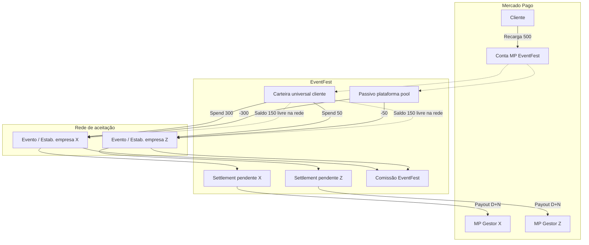

# Plano de Créditos do Cliente — EventFest

**Documento para validação jurídica, fiscal e contábil**  
**Versão:** 3.1 (2026-05-20)  
**Status:** Alinhamento jurídico e contábil registrado — **não constitui parecer formal**; seguir checklist NF pendente  
**Público:** Admin Master EventFest, gestores (empresas parceiras), assessoria jurídica e contábil

---

## 1. Sumário executivo

Este documento descreve como o sistema EventFest pretende operar **créditos pré-pagos em rede** (carteira **única do cliente na plataforma**), utilizáveis em **qualquer evento ou estabelecimento parceiro** habilitado — regra **obrigatória de produto**.

Inclui:

- Onde o dinheiro fica após a recarga via Mercado Pago (MP);
- Uso do crédito (ingresso, consumo, PDV) em **outro evento, outra empresa ou outro estabelecimento**;
- Comissão EventFest e repasse ao **gestor receptor** de cada consumo;
- Saldo remanescente (ex.: R$ 200 de R$ 500) **sem restrição de empresa de origem**;
- Lançamentos, liquidação e implicações para o jurídico (Brasil).

### Decisões de produto (v3)

| # | Regra |
|---|--------|
| D1 | **Carteira universal** por cliente (`user_id`) — saldo único EventFest |
| D2 | Crédito remanescente pode ser usado em **qualquer** evento/estabelecimento **habilitado na rede** |
| D3 | Recarga via MP na **conta EventFest**; passivo agregado na **plataforma** (não “preso” à empresa onde comprou) |
| D4 | Comissão EventFest calculada **em cada uso**, no estabelecimento/empresa **onde ocorreu o consumo** |
| D5 | Gestor **só** liquida parcela dos **spends na sua empresa**; não saca saldo global do cliente |
| D6 | Módulo só ativo para empresas/eventos com plano + flags de consumo |
| D7 | **Crédito permanece na EventFest** — confirmado pelo jurídico |
| D8 | **Extrato transparente** — toda recarga e todo uso com descrição clara (exigência contábil) |
| D9 | Recarga: cliente recebe **crédito integral** (ex. paga R$ 250 → saldo +250); taxa MP não reduz crédito |
| D10 | Taxa MP na recarga registrada; **não pode superar** % comissão EventFest sobre o valor (validação sistema + contrato) |

---

## 2. Alinhamento jurídico e contábil (reunião 2026-05-20)

### 2.1 Jurídico

- Mantida a tese: **saldo e crédito sob responsabilidade EventFest** (carteira rede universal).
- Uso em qualquer parceiro habilitado permanece válido.
- **Contrato do cliente** deve explicitar: crédito EventFest, taxa MP, valor creditado = valor pago, regras de uso e estorno.

### 2.2 Contábil

- **Extrato é peça central:** cada operação com `public_description` legível (recarga, uso, estorno).
- Na **aquisição de crédito:** registrar claramente valor pago, valor creditado, taxa MP e entrada líquida na conta EventFest.
- No **uso (transferência contábil para empresa):** registrar empresa/evento/produto, valor bruto, comissão EventFest e valor atribuído ao gestor receptor.
- Exemplo acordado:

| Fato | Valor | Registro |
|------|-------|----------|
| Cliente paga MP | R$ 250,00 | `gross_paid_amount` |
| Crédito na carteira | R$ 250,00 | `credit_granted_amount` (= gross) |
| Taxa MP (custo EF) | ex. R$ 12,00 | `mp_fee_amount`; `net_cash_received` = R$ 238,00 |
| Cliente consome | R$ 80,00 | Extrato: uso em [Empresa Z] — evento — item |

- **Validação econômica:** taxa MP sobre a recarga **≤** percentual de comissão EventFest sobre consumo (para não operar recarga com prejuízo estrutural antes dos usos).

---

## 3. Glossário

| Termo | Significado |
|-------|-------------|
| **Carteira EventFest** | Saldo pré-pago **único** do cliente na plataforma (BRL) |
| **Rede de aceitação** | Conjunto de empresas/eventos/estabelecimentos com `credit_acceptance_enabled` |
| **Top-up / recarga** | Cliente paga via MP; credita a carteira universal |
| **Spend / consumo** | Uso do crédito no **local receptor** (empresa Z, evento Y, estabelecimento W) |
| **Origem da recarga** | Empresa/evento onde o cliente **iniciou** a compra de crédito (metadado; **não** restringe uso) |
| **Passivo plataforma** | Total de crédito emitido e ainda não consumido/estornado (`platform_credit_liability`) |
| **Split de consumo** | Divisão do spend: comissão EventFest + parte do gestor **receptor** |
| **Estabelecimento** | Unidade de consumo (bar, loja, setor) vinculada a empresa/evento |
| **Ledger** | Livro razão imutável (append-only) |

---

## 4. Regra fundamental: crédito remanescente em toda a rede

### 4.1 Enunciado (obrigatório)

> Se o cliente recarregar R$ 500 no contexto do **evento A / empresa X** e consumir apenas R$ 300, os **R$ 200 remanescentes** permanecem na **carteira EventFest** e podem ser usados em:
>
> - Outro evento da mesma empresa;
> - Evento de **outra empresa** parceira;
> - **Outro estabelecimento comercial** (mesma ou outra empresa) na rede.

**Não há** bloqueio por empresa de origem da recarga.

### 4.2 Exemplo completo

| Etapa | Ação | Sistema |
|-------|------|---------|
| 1 | Recarga R$ 500 (contexto: evento A, empresa X) | MP → EventFest (líquido ex. R$ 475 após taxa); carteira cliente **+500**; extrato descreve recarga; passivo plataforma +500 |
| 2 | Consumo R$ 300 no evento A | Carteira -300; split: comissão EF + parte gestor **empresa X**; passivo plataforma -300 |
| 3 | Saldo R$ 200 | Carteira cliente = 200 (universal) |
| 4 | Consumo R$ 50 no evento B, **empresa Z** | Carteira -50; split: comissão EF + parte gestor **empresa Z**; passivo -50 |
| 5 | Saldo R$ 150 | Pode usar em qualquer outro ponto da rede habilitada |

**Comissão EventFest:** incide sobre **cada transação de uso** (R$ 300, depois R$ 50, etc.), no % vigente para a **empresa/estabelecimento receptor**, não sobre o saldo parado.

### 4.3 O que NÃO muda

- Gestor da empresa X **não** “leva” os R$ 200 não usados;
- Empresa X **não** tem escrow exclusivo sobre o saldo remanescente;
- Uso em empresa Z **não** exige nova recarga MP pelo cliente.

---

## 5. Extrato — textos mínimos (contrato + sistema)

### 5.1 Recarga

**Cliente (obrigatório na UI e no extrato exportável):**

> Recarga de crédito EventFest — R$ [valor] creditados na sua carteira. Pagamento Mercado Pago em [data/hora]. Ref. [id]. O valor creditado corresponde ao valor pago. Taxas de processamento do Mercado Pago não reduzem seu saldo de crédito, conforme Termos de Uso.

**Registro interno EventFest:** `mp_fee_amount`, `net_cash_received`, snapshot do % comissão consumo e flag `fee_validation_ok`.

### 5.2 Uso / alocação à empresa parceira

**Cliente:**

> Uso de crédito — [Empresa] — [Evento] — [Descrição item] — R$ [valor]. Saldo após: R$ [saldo].

**Gestor receptor:**

> Crédito EventFest recebido — Ref. [id] — Valor bruto R$ [gross] — Comissão plataforma R$ [fee] — Valor líquido empresa R$ [manager].

---

## 6. Habilitação: quem aceita crédito na rede

### 6.1 Para **recarregar** crédito

- Cliente autenticado;
- Ponto de venda de crédito habilitado (evento, app, vitrine) — empresa com plano consumo + contrato + flag admin;
- Opcional: pacotes promocionais por campanha/evento de **origem** (só UX).

### 6.2 Para **usar** crédito (spend)

O **receptor** deve satisfazer:

1. Empresa com plano `ticket_plus_consumption` ou `consumption_or_license`;
2. Flag admin de módulo consumo;
3. Contrato de consumo aceito;
4. **Evento** com `credit_consumption_enabled` **ou** **estabelecimento** com `credit_acceptance_enabled`;
5. Empresa/evento **ativo** e assinatura/listing válidos (regras existentes EventFest).

**Validação no RPC `credit_spend`:** `receiver_company_id` + `receiver_event_id` / `receiver_establishment_id` — **não** validar igualdade com origem da recarga.

### 6.3 Estabelecimentos

Cadastro sugerido: `credit_establishments` (id, company_id, event_id opcional, nome, ativo, flags PDV).

Um evento pode ter N estabelecimentos (bares, lojas). O spend sempre aponta para o **receptor** real para auditoria e split.

---

## 7. Respostas operacionais (atualizadas)

### 7.1 Comissão no uso: transferência automática MP para EventFest?

| Momento | MP (dinheiro real) | Sistema |
|---------|-------------------|---------|
| **Recarga** | Entrada na conta **MP EventFest** | +carteira universal; +passivo plataforma |
| **Uso** (qualquer parceiro) | **Sem** nova cobrança MP (padrão) | Débito carteira; split para **gestor receptor** + comissão EF |

Comissão EventFest: **lançamento automático** em cada spend; permanência do valor na esfera EventFest até apuração contábil (sem novo PIX por consumo, salvo exigência jurídica futura).

### 7.2 Valor consumido: gestor pode usar como quiser?

| Valor | Gestor receptor |
|-------|-----------------|
| Saldo R$ 200 **não usado** na rede | **Nenhum** gestor saca |
| R$ 50 consumidos **na empresa Z** | Apenas gestor **Z** acumula parcela liquidável (após retenção) |
| R$ 300 consumidos **na empresa X** | Apenas gestor **X** acumula parcela daqueles spends |

Cada gestor vê repasses **somente dos consumos no seu CNPJ/empresa**, não do pool global.

### 7.3 Transferências entre “contas” no uso cross-empresa

Não é transferência bancária cliente→gestor no MP. É:

```
1. Débito: carteira universal do cliente
2. Crédito contábil: obrigação EventFest → gestor Z (manager_amount)
3. Crédito contábil: receita/acumulação comissão EventFest (platform_amount)
4. Redução: passivo plataforma (pool global)
5. (Periódico) Payout MP: EventFest → conta MP gestor Z
```

A empresa X **não** participa financeiramente do spend em Z.

---

## 8. Fluxo contábil consolidado (carteira universal)

### 8.1 Recarga R$ 250 (origem: evento A, empresa X)

```
[Cliente] --MP R$ 250,00--> [Conta MP EventFest]
[MP]      taxa ex. R$ 12,00 → net_cash R$ 238,00 na conta EF

[Sistema]
  credit_ledger:        +250  (wallet) + public_description recarga
  platform_liability:   +250  (passivo cliente)
  credit_topup_order:
    gross_paid_amount = 250
    credit_granted_amount = 250
    mp_fee_amount = 12
    net_cash_received = 238
    fee_validation_ok = (12/250 <= comissão_EF%)
  Registro custo MP: contábil EventFest (não debita cliente)
```

### 8.2 Uso R$ 80 — evento B, empresa Z, estabelecimento W

```
[Sistema]
  credit_ledger:        -80   (wallet) + public_description uso/empresa Z
  platform_liability:   -80
  credit_spend_order:   receiver_company_id=Z, receiver_event_id=B,
                        receiver_establishment_id=W
  credit_financial_splits:
    gross_amount: 80
    receiver_company_id: Z
    platform_amount: 6,40    (comissão EventFest)
    manager_amount: 73,60     (gestor Z — liquidável após retenção)
  manager_settlement_ledger (Z): +73,60 pending
```

### 8.3 Saldo remanescente R$ 200 após usos em X e Z

```
wallet_balance: 200
platform_liability: 200 (pool global, não alocado a X nem Z)
```

Próximo uso em **qualquer** parceiro habilitado: repete 6.2 com o receptor da vez.

### 8.4 Estorno R$ 200 não utilizados

```
[Sistema] ledger -200; liability -200; credit_refund_case
[MP] refund ao cliente (se elegível)
```

Estorno é contra a **plataforma**, não contra empresa de origem X isoladamente.

---

## 9. Diagrama — Rede universal



---

## 10. Modelo de dados (v3.1)

| Tabela | Chave / observação |
|--------|-------------------|
| `client_credit_accounts` | **`user_id` UNIQUE** (remove vínculo obrigatório company na conta) |
| `platform_credit_liability` | Singleton ou snapshot diário — passivo total rede |
| `credit_ledger_entries` | `public_description` **obrigatório**; `entry_subtype`; `origin_*` / `receiver_*` |
| `credit_topup_orders` | `gross_paid`, `credit_granted`, `mp_fee`, `net_cash`, validação fee vs comissão |
| `credit_spend_orders` | **`receiver_company_id`**, `receiver_event_id`, `receiver_establishment_id` |
| `credit_financial_splits` | Sempre amarrado ao **receptor** |
| `credit_establishments` | Pontos de aceitação / PDV |
| `manager_credit_settlement_ledger` | Por **`company_id` receptor** |
| `credit_network_settings` | Regras globais (validade, limites) — admin |

**Removido / substituído:** `company_credit_escrow` por empresa (incompatível com saldo cross-empresa).

---

## 11. Comissão, relatórios e auditoria

### 11.1 Por spend (obrigatório)

Registrar: data/hora, cliente, **empresa/evento/estabelecimento receptor**, origem da recarga (se conhecida), gross, % aplicado, platform_fee, manager_amount, canal, idempotency, correlation_id.

### 11.2 Admin Master (exclusivo)

- Comissão EventFest **por receptor / por origem de recarga / consolidado**;
- Passivo plataforma (pool não consumido);
- Conciliação MP recargas vs. liability;
- **Auditoria forense** drill-down (pedidos jurídicos);
- Mapa de uso cross-empresa (R$ 500 origem X → consumos X e Z).

### 11.3 Gestor

- Spends e repasses **apenas da sua empresa**;
- Não vê saldo global de clientes em outras empresas;
- Vê que o pagamento foi “crédito EventFest” (não MP direto).

---

## 12. Gestor, saque e estorno (inalterado em espírito)

| Situação | Regra |
|----------|--------|
| Saque gestor | Só `manager_withdrawable_balance` da **própria empresa** |
| Retenção | D+N após evento / spend |
| Estorno saldo não usado | Debita carteira universal; refund MP; reduz passivo plataforma |
| Estorno após payout a gestor Z | Clawback Z ou processo disputas |

---

## 13. Questões para validação jurídica e fiscal

> **Mudança material:** a EventFest opera como **rede de valor armazenado multi-estabelecimento**, não como crédito “preso” a um organizador.

### 11.1 Regulatório

| # | Questão |
|---|---------|
| J1 | Carteira **única** utilizável em múltiplos CNPJs parceiros: enquadramento como **emissor de moeda eletrônica** ou arranjo fechado multi-participante? |
| J2 | Credor do saldo R$ 200: **EventFest** perante o cliente? |
| J3 | Contrato cliente: rede EventFest vs. contrato por estabelecimento |
| J4 | CDC: arrependimento na **recarga** vs. no **consumo** em estabelecimento terceiro |
| J5 | Insolvência de empresa Z onde cliente **não gastou** — saldo na carteira permanece? (esperado: sim) |
| J6 | Insolvência **EventFest** — proteção do passivo agregado |

### 11.2 Tributário

| # | Questão |
|---|---------|
| T1 | NF na recarga (EventFest emite “venda de crédito”?) |
| T2 | NF no consumo: estabelecimento **Z** emite ao cliente? |
| T3 | ISS comissão EventFest: município sede EF ou do local do spend? |
| T4 | Repasse a gestor Z caracterizado como **repasse** vs. **pagamento por serviço** |
| T5 | Crédito remanescente cross-empresa: impacto PIS/COFINS sobre valor total do pool |

### 11.3 Pagamentos

| # | Questão |
|---|---------|
| M1 | Pool único MP EventFest + payout a N gestores: modelo marketplace? |
| M2 | KYC/AML para recargas altas na rede |
| M3 | Limites de uso diário por CPF na rede |

### 13.4 Documentação jurídica adicional

- [ ] Termos — **Carteira EventFest Rede** (aceitação multi-estabelecimento)
- [x] Cláusula: valor creditado = valor pago; taxa MP não reduz crédito (rascunho técnico v3.1)
- [x] Extrato com descrição em recarga e uso (requisito contábil)
- [ ] Aditivo parceiro — obrigação de **aceitar** crédito rede e emitir NF no consumo
- [ ] Política de validade do saldo (prazo máximo na rede)
- [ ] Política estorno cross-empresa
- [ ] NF na recarga vs. consumo (pendente contábil)

---

## 14. Posicionamento EventFest (v3.1)

| Tema | Posição |
|------|---------|
| Carteira | **Uma por cliente** na plataforma; crédito **EventFest** |
| Saldo remanescente | **Livre na rede** de parceiros habilitados |
| Recarga MP | Conta **EventFest**; cliente recebe **crédito integral** |
| Taxa MP | Registrada; **não** reduz saldo cliente; validar ≤ comissão EF % |
| Extrato | Descrição **obrigatória** em recarga, uso e estorno |
| Uso = alocação empresa | Registrado com empresa/evento/produto + split |
| Comissão | Por **cada spend** no estabelecimento receptor |
| Repasse gestor | Só do spend **na sua empresa**; payout periódico |
| MP por consumo | Não (padrão); liquidação em lote |

---

## 15. Arquitetura técnica e fases

### 15.1 Serviços (Supabase)

| Serviço | Função |
|---------|--------|
| `create-credit-checkout` | Recarga → MP EventFest → wallet universal |
| `mercadopago-webhook` | `credit_topup_settle` |
| `credit-spend` | Valida **receptor** na rede; débito + split |
| `list-credit-acceptance-network` | Locais onde pode gastar (mapa/lista) |
| `manager-credit-payout` | Payout por `company_id` |
| `reconcile-platform-liability` | wallet sum vs. liability vs. MP |

### 15.2 Fases

| Fase | Entregável |
|------|------------|
| 0 | Termos + cláusulas MP (**parcial** ✓) |
| 1 | Schema v3.1 + extrato + top-up gross/mp_fee + validação fee |
| 2 | UI carteira + extrato detalhado + rede EventFest |
| 3 | Spend ingresso cross-empresa |
| 4 | PDV + estabelecimentos |
| 5 | Relatórios admin + auditoria cross-empresa |
| 6 | Payout + clawback por empresa receptora |
| 7 | App mobile |

---

## 16. Checklist assessoria (v3.1)

| Item | Status |
|------|--------|
| Credor do saldo — **EventFest** | ☑ alinhado |
| Carteira rede universal | ☑ alinhado |
| Extrato claro recarga + uso | ☑ exigência contábil |
| Crédito integral vs. taxa MP | ☑ regra + contrato |
| Validação taxa MP ≤ comissão EF | ☑ regra sistema |
| Enquadramento BC — rede multi-CNPJ | ☐ pendente |
| Termos cliente — texto final | ☐ jurídico |
| NF recarga vs. consumo por receptor | ☐ contábil |
| ISS/PIS/COFINS pool global | ☐ contábil |
| Modelo MP pool + N payouts | ☐ |
| Validade e estorno | ☐ |
| **Go implementação Fase 1** | ☑ |

---

## 17. Histórico de versões

| Versão | Data | Alteração |
|--------|------|-----------|
| **3.1** | **2026-05-20** | **Extrato obrigatório; recarga gross=credit; taxa MP; validação fee; alinhamento jurídico/contábil** |
| 3.0 | 2026-05-19 | Carteira universal; rede cross-empresa |
| 2.0 | 2026-05-19 | Carteira por empresa (revogada) |
| 1.0 | 2026-05-19 | Plano inicial |

---

**Contato interno:** equipe técnica EventFest  
**Uso externo:** compartilhar integralmente com assessoria jurídica e contábil.
